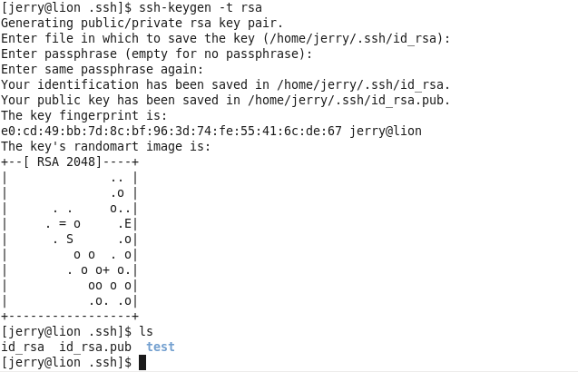
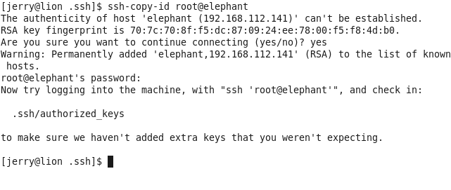
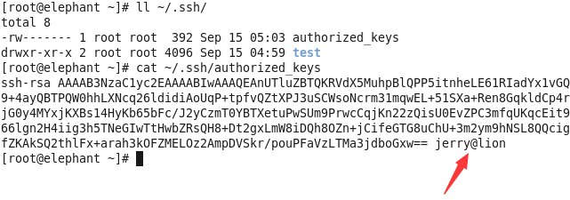

## 配置ssh免密码登录
配置公钥、私钥，在服务器之间交换，可以形成服务器之间访问的有效认证，省去每次输入密码的麻烦。Hadoop集群之间的访问也是需要ssh免密码认证的。

### 操作
0. 注意
    - 下面的用户你可以直接全部使用root用户，或者全部使用一个普通用户（推荐普通用户，如果你是第一次学习那就root）
    - 如果使用普通用户，需要在/etc/sudoers中添加： 用户名 ALL=(ALL) NOPASSWD:ALL
1. 在CM Service的服务器（lion）上生成公钥、私钥
	- lion(root用户)下执行:
		- $ ssh-keygen -t rsa 
		- 回车、回车、回车（全部默认，或者你也可以设定passphrase，这样的话，在后面安装集群时需要你填写passphrase）
		- $ cd ~/.ssh
		- $ ls 查看当前目录下生成的密钥、公钥	
2. 将公钥上传到要登录的服务器的root账户（elephant tiger horse monkey lion）
	- lion(root用户)下执行:
		- $ ssh-copy-id root@elephant (还包括tiger horse monkey lion)
		- 输入elephant的root账户的密码，即可完成
3. 查看生成的文件
	- elephant tiger horse monkey lion下执行:
		- root$ ll ~/.ssh/ 
		- root$ cat ~/.ssh/authorized_keys
4. 登录验证
	- lion下执行:
		- $ ssh elephant（还包括tiger horse monkey lion）	
		- 查看是否能登录

### 可能出现的问题
- 问题：在lion下执行 $ ssh elephant时，显示Agent admitted failure to sign using the key
- 解决：在lion下执行 $ ssh-add ~/.ssh/id_rsa，然后重新执行$ ssh-copy-id root@elephant，最后检验ssh登录

### 截图
- 下面的截图用户名有点不对，你只需要全部统一用root，或者全部统一用普通用户（带无密码权限）即可

- 在CM Service的服务器（lion）上生成公钥、私钥

- 将公钥上传到要登录的服务器的root账户

- 查看生成的文件

- 登录验证

