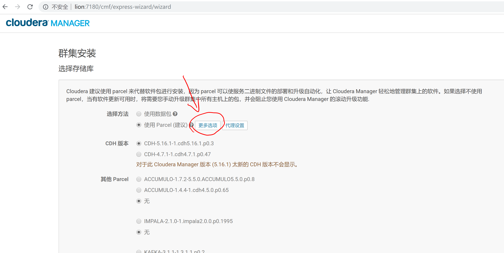
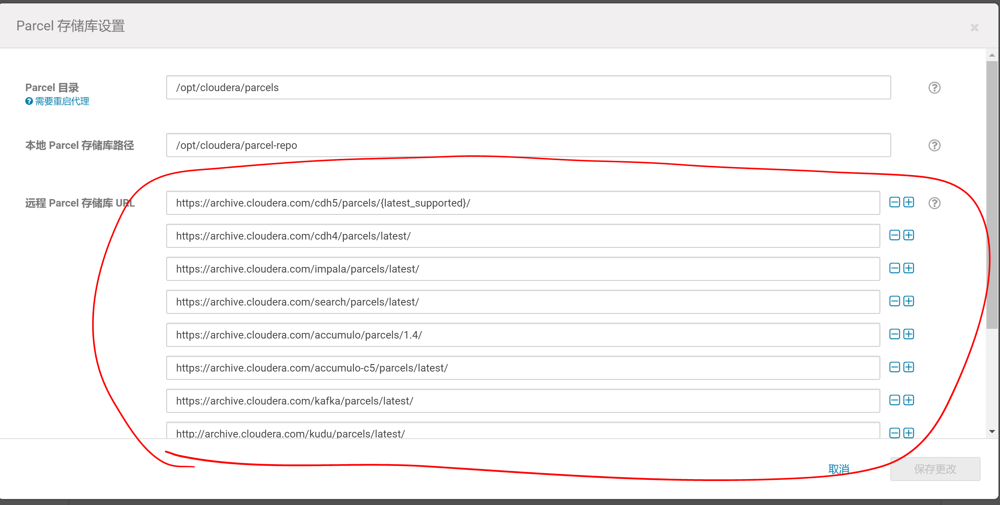
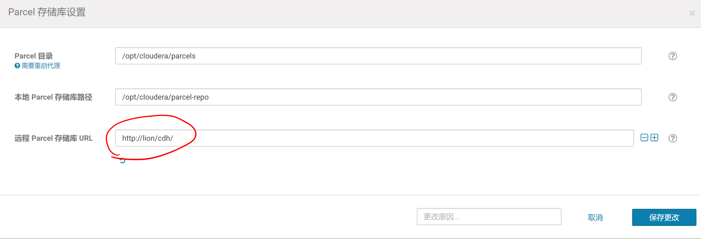
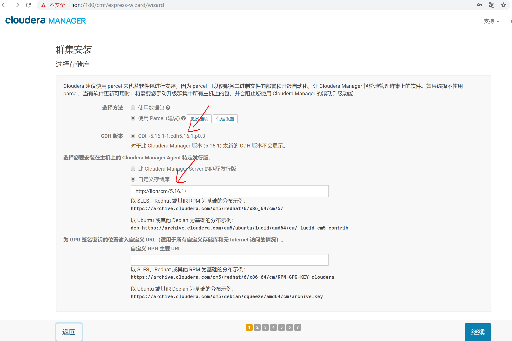
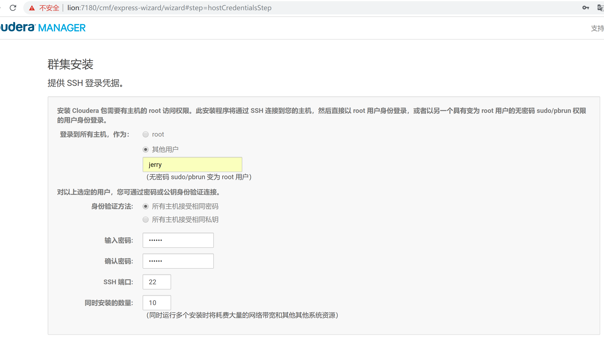
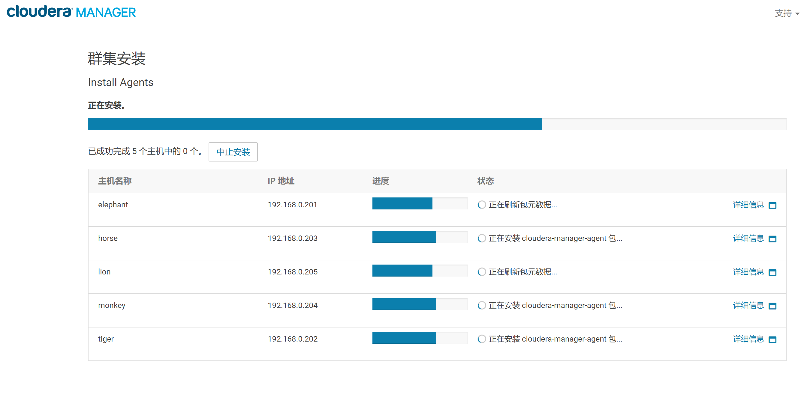

## CM Agent 安装

1. 使用浏览器进入http://lion:7180 页面，准备安装Agent
	- 登录默认 账户:admin 密码:admin
	
	- 接受“最终用户许可条款和条件”，点击继续
	- 选择Cloudera Enterprise的试用版（可以试用60天，结束后会自动退回普通版），继续
	- 输入hostname:elephant tiger horse monkey lion，然后search搜索，成功后继续
	
	
	- 进入“集群安装-选择存储库”界面
		1. 选择“使用Parcel”，点击更多选项
		
		2. 在弹出的界面中，删除所有远程URL
		
		3. 添加我们之前已经配置好的CDH包的HTTP仓库URL
		
		4. 点击保存更改，界面“CDH版本”处变化成我们自己的CDH包的版本，同时添加Cloudera Manager Agent的库
		
	- 继续，不要安装该处提示的JDK，因为前面我们已经安装过了
	- 继续，不启用单用户模式
	- 来到“集群安装-提供 SSH 登录凭据”页面
	- 设置已经配好SSH的用户，确保每台服务器该用户名都已配置好SSH认证。如果需要非root执行，需要每台服务器配置对应用户的“免密码执行sudo”权限（在/etc/sudoers中添加jerry   ALL=(ALL)       NOPASSWD:ALL）
	
	- 点击继续，开始安装每个节点的Agent（此处最容易出问题的是yum本地源配置错误、CM依赖的其他安装包没安装正确）
	
	

